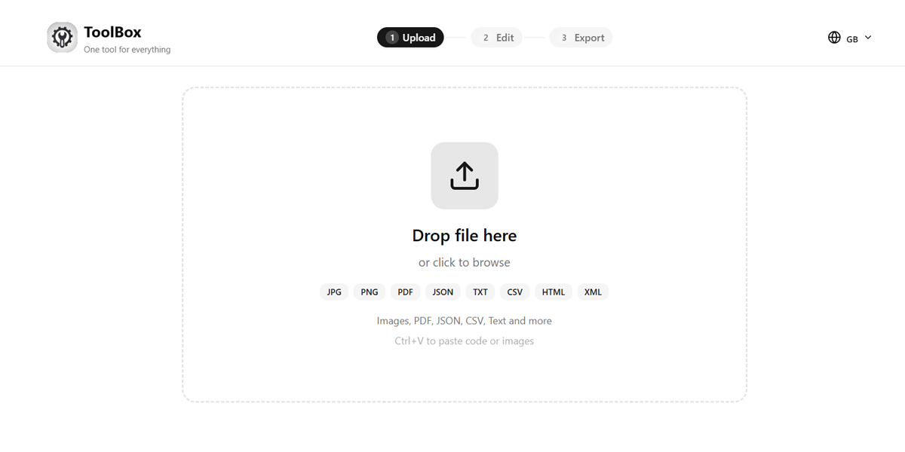

# ToolBox


ToolBox is a simple and fast file, text, and URL processing application that runs entirely in your browser. It lets you input, edit, and export content securely and privately, with all processing happening **100% locally**.



## Features

* **Browser-based**: No installation required, runs entirely in your browser
* **Multiple Formats**: Supports Images, PDF, JSON, CSV, XML, HTML, CSS, JavaScript, Markdown, Text, and URLs
* **Dynamic Editing**: Edit options adapt to the detected file type
* **Export Flexibility**: Export in formats suited to your content
* **Image Processing**: Compress, resize, rotate
* **Text/Code Processing**: Format, minify, transform
* **URL Tools**: QR code generation
* **Clean UI**: Minimalist, mobile-first, single-page workflow
* **Secure & Private**: Everything runs locally; no data leaves your device

## Getting Started

### Prerequisites

* Node.js (v14 or higher)
* npm (Node package manager)

## Installation & Running

1. Clone the repository:

```bash
git clone https://github.com/W-DOS0/ToolBox.git
cd ToolBox
```

2. Install the required npm packages:

```bash
npm install
```

3. Start the application:

```bash
npm run dev
```

Open your browser at `http://localhost:3000` to use ToolBox.

## How It Works

ToolBox uses a **3-step workflow: Input → Edit → Export**.

* **Frontend (Next.js + React + Tailwind + shadcn/ui)**: Handles file uploads, text/URL input, dynamic edit options, and export interface.
* **Processing**: All operations happen **locally in the browser**, keeping your data secure and private.

## Dependencies

**Frontend**

* Next.js: React framework for building modern web apps
* React: JavaScript library for user interfaces
* Tailwind CSS: Utility-first styling framework
* shadcn/ui: UI components for streamlined design

**Utilities**

* File type detection for dynamic edits
* Image processing: compress, resize, rotate
* Text/JSON/Code processing: format, minify, transform
* QR code generation for URLs

## Contributing

Contributions are what make the open source community amazing. Any help is appreciated.

If you have a suggestion, fork the repo and create a pull request. You can also open an issue tagged **"enhancement"**. Don't forget to give the project a star!

**Fork the Project**
**Create your Feature Branch**

```bash
git checkout -b feature/AmazingFeature
```

**Commit your Changes**

```bash
git commit -m 'Add AmazingFeature'
```

**Push to the Branch**

```bash
git push origin feature/AmazingFeature
```

**Open a Pull Request**
Go to your repository on GitHub, press the Compare & pull request button, and submit your pull request.

## Acknowledgements

Next.js and React for the frontend framework

Tailwind CSS for styling

shadcn/ui for UI components

Inspired by local-first processing apps

## License

This project is licensed under the MIT License - see the LICENSE file for details.

MIT © 2026 ToolBox
See [LICENSE](./LICENSE)
